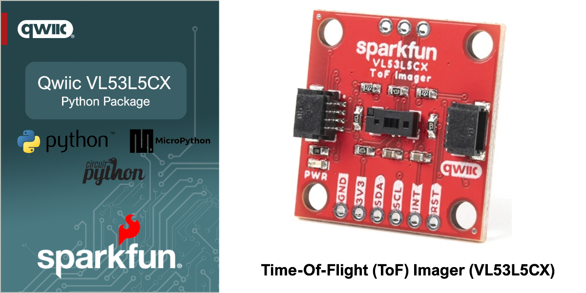

# SparkFun Qwiic VL53L5CX - Python Package


[](https://docs.sparkfun.com/qwiic_vl53l5cx_py/classqwiic__vl53l5cx_1_1qwiic__vl53l5cx_1_1_qwiic_v_l53_l5_c_x.html)

The SparkFun Qwiic ToF Distance Sensing VL53L5CX Module provides a simple and cost effective solution for adding ToF Distance Sensing capabilities to your project. Implementing a SparkFun Qwiic I2C interface, these sensors can be rapidly added to any project with boards that are part of the SparkFun Qwiic ecosystem.

This repository implements a Python package for the SparkFun Qwiic VL53L5CX. This package works with Python, MicroPython and CircuitPython.

### Contents

* [About](#about-the-package)
* [Installation](#installation)
* [Supported Platforms](#supported-platforms)
* [Documentation](https://docs.sparkfun.com/qwiic_vl53l5cx_py/classqwiic__vl53l5cx_1_1qwiic__vl53l5cx_1_1_qwiic_v_l53_l5_c_x.html)
* [Examples](#example-use)

## About the Package

This python package enables the user to access the features of the VL53L5CX via a single Qwiic cable. This includes reading tof/distance array, setting frequency, setting i2c address and more. The capabilities of the VL53L5CX are each demonstrated in the included examples.

New to qwiic? Take a look at the entire [SparkFun qwiic ecosystem](https://www.sparkfun.com/qwiic).

### Supported SparkFun Products

This Python package supports the following SparkFun qwiic products on Python, MicroPython and Circuit python. 

* [SparkFun ToF Distance Sensing Sensor - VL53L5CX](https://www.sparkfun.com/products/18642)

### Supported Platforms

| Python | Platform | Boards |
|--|--|--|
| Python | Linux | [Raspberry Pi](https://www.sparkfun.com/raspberry-pi-5-8gb.html) , [NVIDIA Jetson Orin Nano](https://www.sparkfun.com/nvidia-jetson-orin-nano-developer-kit.html) via the [SparkFun Qwiic SHIM](https://www.sparkfun.com/sparkfun-qwiic-shim-for-raspberry-pi.html) |
| MicroPython | Raspberry Pi - RP2, ESP32 | [SparkFun Pro Micro RP2350](https://www.sparkfun.com/sparkfun-pro-micro-rp2350.html), [SparkFun IoT RedBoard ESP32](https://www.sparkfun.com/sparkfun-iot-redboard-esp32-development-board.html), [SparkFun IoT RedBoard RP2350](https://www.sparkfun.com/sparkfun-iot-redboard-rp2350.html)
|CircuitPython | Raspberry Pi - RP2, ESP32 | [SparkFun Pro Micro RP2350](https://www.sparkfun.com/sparkfun-pro-micro-rp2350.html), [SparkFun IoT RedBoard ESP32](https://www.sparkfun.com/sparkfun-iot-redboard-esp32-development-board.html), [SparkFun IoT RedBoard RP2350](https://www.sparkfun.com/sparkfun-iot-redboard-rp2350.html)

> [!NOTE]
> The listed supported platforms and boards are the primary platform targets tested. It is fully expected that this package will work across a wide variety of Python enabled systems. 

## Installation 

The first step to using this package is installing it on your system. The install method depends on the python platform. The following sections outline installation on Python, MicroPython and CircuitPython.

### Python 

#### PyPi Installation

The package is primarily installed using the `pip3` command, downloading the package from the Python Index - "PyPi". 

Note - the below instructions outline installation on a Linux-based (Raspberry Pi) system.

First, setup a virtual environment from a specific directory using venv:
```sh
python3 -m venv path/to/venv
```
You can pass any path as path/to/venv, just make sure you use the same one for all future steps. For more information on venv [click here](https://docs.python.org/3/library/venv.html).

Next, install the qwiic package with:
```sh
path/to/venv/bin/pip3 install sparkfun-qwiic-vl53l5cx
```
Now you should be able to run any example or custom python scripts that have `import qwiic_vl53l5cx` by running e.g.:
```sh
path/to/venv/bin/python3 example_script.py
```

### MicroPython Installation
If not already installed, follow the [instructions here](https://docs.micropython.org/en/latest/reference/mpremote.html) to install mpremote on your computer.

Connect a device with MicroPython installed to your computer and then install the package directly to your device with mpremote mip.
```sh
mpremote mip install github:sparkfun/qwiic_vl53l5cx_py
```

If you would also like to install the examples for this repository, issue the following mip command as well:
```sh
mpremote mip install --target "" github:sparkfun/qwiic_vl53l5cx_py@examples
```

### CircuitPython Installation
If not already installed, follow the [instructions here](https://docs.circuitpython.org/projects/circup/en/latest/#installation) to install CircUp on your computer.

Ensure that you have the latest version of the SparkFun Qwiic CircuitPython bundle. 
```sh
circup bundle-add sparkfun/Qwiic_Py
```

Finally, connect a device with CircuitPython installed to your computer and then install the package directly to your device with circup.
```sh
circup install --py qwiic_vl53l5cx
```

If you would like to install any of the examples from this repository, issue the corresponding circup command from below. (NOTE: The below syntax assumes you are using CircUp on Windows. Linux and Mac will have different path seperators. See the [CircUp "example" command documentation](https://learn.adafruit.com/keep-your-circuitpython-libraries-on-devices-up-to-date-with-circup/example-command) for more information)

```sh
circup example qwiic_vl53l5cx\qwiic_vl53l5cx_ex1_distance_array
circup example qwiic_vl53l5cx\qwiic_vl53l5cx_ex3_set_freq
circup example qwiic_vl53l5cx\qwiic_vl53l5cx_ex6_settings
circup example qwiic_vl53l5cx\qwiic_vl53l5cx_ex8_set_address
```

Example Use
 ---------------
Below is a quickstart program to print readings from the VL53L5CX.

See the examples directory for more detailed use examples and [examples/README.md](https://github.com/sparkfun/qwiic_vl53l5cx_py/blob/master/examples/README.md) for a summary of the available examples.

```python

import qwiic_vl53l5cx 
import sys
from math import sqrt
import time

def runExample():
	print("\nQwiic VL53LCX Example 1 - DistanceArray\n")

	myVL53L5CX = qwiic_vl53l5cx.QwiicVL53L5CX() 

	if myVL53L5CX.is_connected() == False:
		print("The device isn't connected to the system. Please check your connection", file=sys.stderr)
		return

	print ("Initializing sensor board. This can take up to 10s. Please wait.")
	if myVL53L5CX.begin() == False:
		print("Sensor initialization unsuccessful. Exiting...", file=sys.stderr)
		sys.exit(1)

	myVL53L5CX.set_resolution(8*8) # enable all 64 pads
	image_resolution = myVL53L5CX.get_resolution()  # Query sensor for current resolution - either 4x4 or 8x8

	image_width = int(sqrt(image_resolution)) # Calculate printing width
	myVL53L5CX.start_ranging()

	while True:
		if myVL53L5CX.check_data_ready():
			measurement_data = myVL53L5CX.get_ranging_data()
			for y in range (0, (image_width * (image_width - 1) )+ 1, image_width):
				for x in range (image_width - 1, -1, -1):
					print("\t", end="")
					print(measurement_data.distance_mm[x + y], end = "")
				print("\n")
			print("\n")
		
		time.sleep(0.005)
	
if __name__ == '__main__':
	try:
		runExample()
	except (KeyboardInterrupt, SystemExit) as exErr:
		print("\nEnding Example")
		sys.exit(0)
```
<p align="center">

</p>
